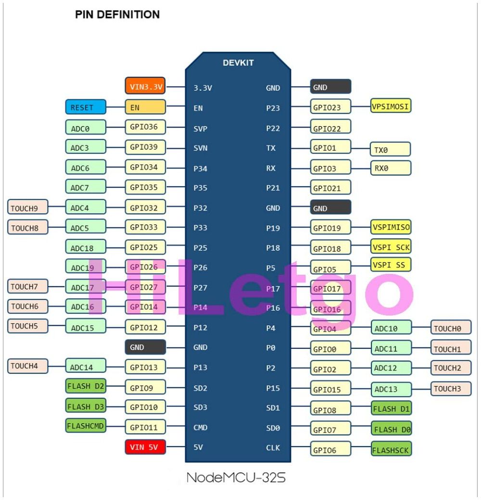

Wellhouse Monitor

As of this writing, this monitors the well pump current.

TODO:
- monitor water pressure
- leak detection
- emergency auto shutoff
- anything else that will protect the well

ESP32s - one of those amazon HiLetgo boards. Search amazon order history. Select Node32s in board manager.

